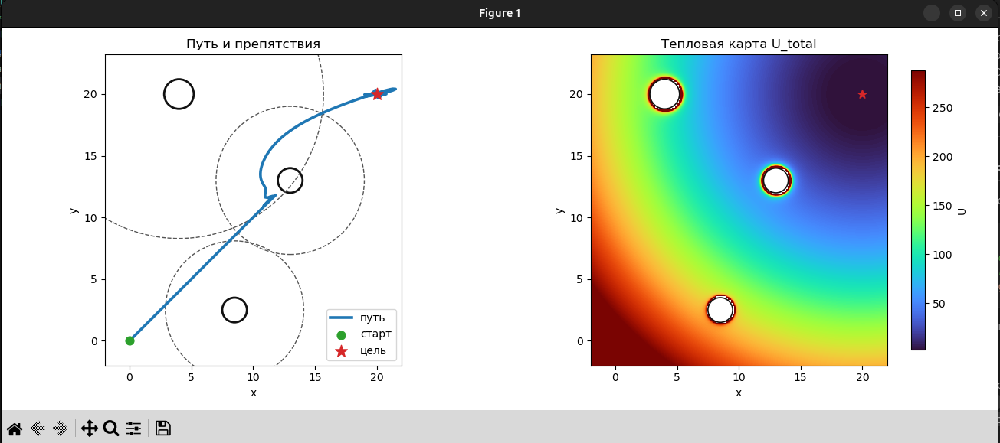
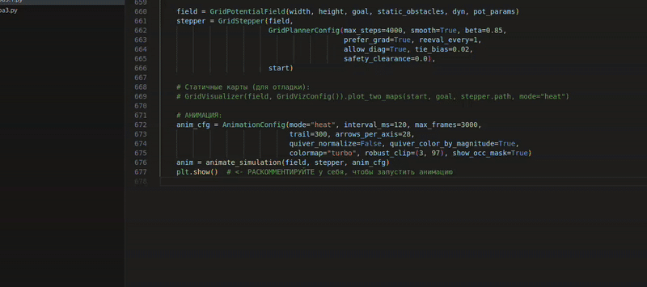

# Потенциальные поля: непрерывная плоскость и дискретная решётка

Учебный набор реализаций метода потенциальных полей для планирования траекторий:

- **Задача 1** - непрерывная плоскость с круглыми препятствиями: притяжение к цели, отталкивание, движение по антиградиенту, визуализация траектории и поля.
- **Задача 2** - дискретная решётка `width×height`: дискретный потенциал, движение по узлам (8-связность), динамические препятствия (преследование), статичная визуализация и анимация.

## Требования

- Python 3.9+
- Пакеты:
  - `numpy`
  - `matplotlib`
  - для сохранения GIF - дополнительно `pillow`, либо установленный `ffmpeg`

Пример установки зависимостей:

```bash
pip install numpy matplotlib pillow
```

## Структура проекта (пример)

- `lab3.py` - реализация для плоскости (ООП):
  - карта пути с препятствиями;
  - тепловая, векторная и/или потоковая карта поля.
- `lab3.1.py` - реализация для решётки (ООП):
  - жёсткая маска занятости + SDF (клиренс);
  - запрет «срезания углов» (corner-cutting);
  - динамика преследователя;
  - анимация движения.

Имена файлов условные - допускается использование собственных имён. По умолчанию код ничего не сохраняет на диск, явное сохранение изображений и GIF настраивается в пользовательском коде.

---

## Задача 1 - непрерывная плоскость

Пример целевого результата:



Реализуется движение точки по антиградиенту суммарного потенциала: притяжение к цели + отталкивание от препятствий. Предусмотрена визуализация:

- траектории движения;
- препятствий;
- карты потенциалов (тепловая / векторная / потоковая).

### Основные параметры

#### Притяжение к цели

- `PotentialParams.k_att` - коэффициент притяжения к цели.
  - Уменьшение `k_att` делает влияние препятствий относительно более сильным.
  - Увеличение `k_att` «протягивает» траекторию ближе к прямой к цели.

#### Отталкивание от препятствий

Для каждого препятствия задаются:

- `eta` - «сила» отталкивания;
- `rho0` - радиус влияния препятствия.

Особенности:

- Отталкивание проявляется только в зоне влияния: при расстоянии до центра препятствия `phi ≤ rho0`.
- Увеличение `eta` и/или `rho0` делает препятствие «выше и шире» на карте потенциалов.

#### Шаг интегрирования и сглаживание

Параметры планировщика:

- `PlannerConfig.use_ema` - включение экспоненциального сглаживания шага;
- `PlannerConfig.beta` - коэффициент EMA (насколько сильно сглаживаются изменения направления);
- `PlannerConfig.clip_step` - ограничение максимальной длины шага (защита от «перескоков» через узкие объекты и выбросов градиента).

Рекомендуется подбирать `clip_step` так, чтобы типичный шаг был существенно меньше размеров препятствий.

#### Параметры визуализации поля

- `mode` - режим отрисовки поля:
  - `mode="heatmap"` - тепловая карта значения потенциала;
  - `mode="quiver"` - поле векторов (стрелки направления силы / антиградиента);
  - `mode="stream"` - потоковые линии.
- `GridVizConfig.colormap` - палитра (цветовая карта) для тепловой карты.
- `robust_clip=None` - отключение робаст-клиппинга по цветам:
  - полезно для анализа полного диапазона значений;
  - позволяет явно видеть «холмы» вокруг препятствий, даже если они значительно выше фона.

---

## Задача 2 - дискретная решётка

Пример анимации (GIF):



Рассматривается дискретное поле потенциалов на решётке `width×height`. Движение осуществляется по узлам с 8-связностью (возможны диагональные переходы при соблюдении ограничений безопасности). Поддерживаются:

- статичные препятствия;
- динамические препятствия (в том числе преследователь);
- статичная визуализация поля;
- покадровая анимация движения по полю.

### Параметры потенциала

#### Притяжение к цели

- `GridPotentialParams.k_att` - коэффициент притяжения к целевой клетке:
  - увеличение значения делает «склон» к цели более крутым;
  - слишком большое значение может визуально «скрывать» влияние отталкивания на тепловой карте.

#### Слои отталкивания

Отталкивание реализуется через один или несколько слоёв вида:

- `RepulsiveConfig(eta, rho0, cell_radius)`, где:
  - `eta` - сила отталкивания;
  - `rho0` - радиус влияния в метрическом (или «клеточном») пространстве;
  - `cell_radius` - радиус, в котором считается расстояние до препятствия (для работы с SDF/клиренсом).

Типичная схема:

- ближний слой - «жёсткое» отталкивание вокруг стен и препятствий;
- дальний слой - «мягкое» отталкивание, формирующее плавные «холмы» на подходе к препятствиям.

### Безопасность и клиренс

Используются следующие механизмы обеспечения безопасности:

- `occ_mask` - жёсткая маска занятости (стены и заведомо недоступные клетки);
- `clearance` - поле расстояний (SDF) до ближайшего препятствия;
- `GridPlannerConfig.safety_clearance` - подушка безопасности в клетках, например `0.5`.

Особенности:

- траектория не проходит через клетки, помеченные как занятые в `occ_mask`;
- с учётом `clearance` и `safety_clearance` маршрут отодвигается на безопасное расстояние от стен;
- при корректной настройке исключается прохождение через «тонкие» стены.

### Навигация по решётке

Управляющие параметры планировщика:

- `smooth` / `beta` - экспоненциальное сглаживание направления шага:
  - уменьшает дёрганье траектории;
  - делает повороты более плавными.
- `prefer_grad` / `tie_bias` - учёт направления антиградиента `−∇U` при выборе следующей клетки среди равнозначных соседей:
  - позволяет «держаться» направления максимального уменьшения потенциала;
  - `tie_bias` задаёт предпочтения при равенстве значений потенциала у нескольких кандидатов.
- `allow_diag` - разрешение диагональных шагов:
  - при включении используется 8-связность;
  - действует запрет диагонального corner-cutting: переход по диагонали невозможен, если хотя бы одна из прилегающих ортогональных клеток занята.

### Динамические препятствия

Поддерживается задание динамических препятствий, в том числе преследователей, например:

- `DynamicObstacle(pos, every, speed_cells, mode="pursue")`, где:
  - `pos` - начальная позиция;
  - `every` - период обновления (через сколько шагов двигается препятствие);
  - `speed_cells` - длина шага в клетках;
  - `mode="pursue"` - режим преследования агента.

Другие режимы (если предусмотрены реализацией) могут задавать движение по заранее известной траектории, случайный блуждающий объект и т.п.

### Анимация

Анимация настраивается через параметры вида `AnimationConfig`:

- `mode="heat"` - анимация поверх тепловой карты потенциала:
  - видны уровни поля и положение агентов;
- `mode="quiver"` - анимация поля векторов:
  - можно отключить нормировку стрелок (`quiver_normalize=False`),
  - можно раскрашивать стрелки по модулю силы (`quiver_color_by_magnitude=True`).

Дополнительные параметры:

- `interval_ms` - интервал между кадрами в миллисекундах;
- `trail` - длина «хвоста» траектории агента.

Сохранение анимации в GIF возможно через `pillow` либо через установленный `ffmpeg` (с использованием `matplotlib.animation`).

---

## Частые вопросы

### «Параметры препятствий не влияют?»

Рекомендуется проверить следующее:

1. Препятствие действительно попадает в зону влияния: расстояние до препятствия `phi ≤ rho0`.
2. При необходимости:
   - уменьшить `k_att` (притяжение к цели),
   - увеличить `eta` и/или `rho0` у соответствующего препятствия.
3. Для наглядности:
   - включить карту **только отталкивания**:
     - в задаче 1 - использовать режим `mode="heatmap"` и анализировать «холмы» вокруг препятствий;
     - в задаче 2 - смотреть на общую тепловую карту поля.
   - отключить робаст-клип `robust_clip=None`, чтобы цвета не «сливались» и диапазон значений отображался полностью.

### «Маршрут прошёл через стену?»

Во второй задаче это предотвращается комбинацией:

- `occ_mask` (жёсткие стены),
- `clearance` (SDF-клиренс),
- запрет диагонального corner-cutting,
- опциональный `safety_clearance`.

При необходимости можно увеличить `safety_clearance` (например, до `0.5` клетки или больше), чтобы траектория отодвигалась от стен.

### «Что прикладывать к отчёту?»

Рекомендуется подготовить:

- `media/task1.png` - скриншот карты из задачи 1 (путь + поле);
- `media/task2.gif` - анимация из задачи 2 (движение агента и динамические препятствия).

Имена и формат файлов могут отличаться, но важно сохранить содержание: траектория и поля для обеих задач.

---

## Лицензия

MIT
